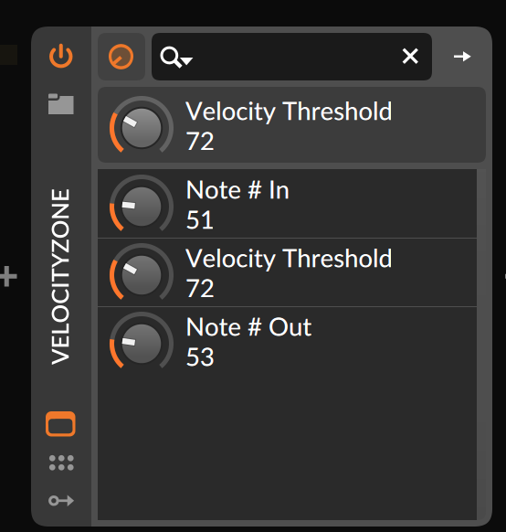

# MIDIVelocityZone Plugin

This Plugin listens to incoming MIDI messages for a specific note, and triggers a different note if the velocity is above a configurable threshold.

It was built using JUCE, so it can be compiled to AU/VST for Mac/Win/Linux.



*Motivation:* The entry-level Roland TD1 KV drumsets fake a ride bell zone when hitting the ride tip with a certain velocity. This information is not passed via MIDI OUT and this plugin will re-create the behaviour before the messages enter your drum VST. 

But you can use it in general to add different sounds for accents to your MIDI pads.

Default Settings:
```
Midi In: MIDI Note 51 / D#2 / Roland TD Ride Bow Tip
Midi Out: MIDI Note 53 / F2 / Roland TD Ride Bell
Midi In Threshold: 70
```

Tested on MacOS with Bitwig and AudioPluginHost.


# MacOS
The MacOS binaries of the plugin formats are useless because of Apple CodeSigning Tralala. 

The Standalone App can still be executed with Control+RightClick->"Open". You can then connect the virtual MIDI instrument via "Audio MIDI Setup.app" to the plugin and your DAW.

If you still want the plugin, compile it yourself. It will be signed for your machine, and your machine only:
```
(brew install cmake)
cd MIDIVelocityZone
cmake .
cmake --build .
# move resulting VST/AU to ~/Library/Audio/Plug-Ins/$format
```

_17/07/2021 Thomas Karmann_
